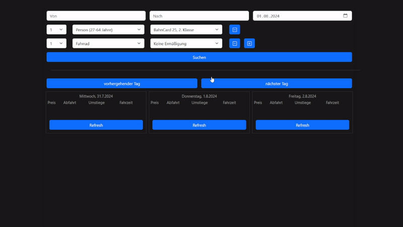

# WHATS THIS
Kinda ugly webapp for comparing prices, durations, departures of *Deutsche Bahn* connections using their undocumented frontend API.

# RUN
Simply run `make start` to build the docker image and run it in background. Default listens to port 8080.

You can run `make stop` to stop the service and `make clean` to (stop the service and) remove the created image.

To just build the image use `make build`.

# TODO
errorhandling missing - so currently it breaks if anything goes wrong